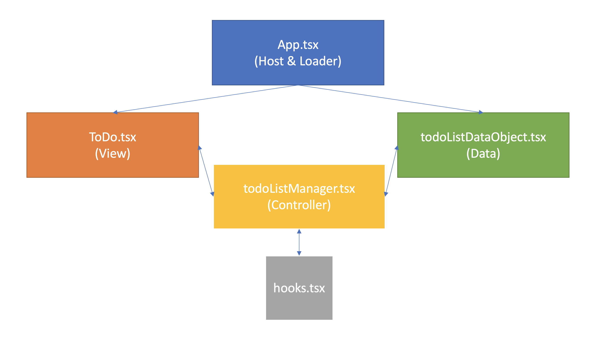
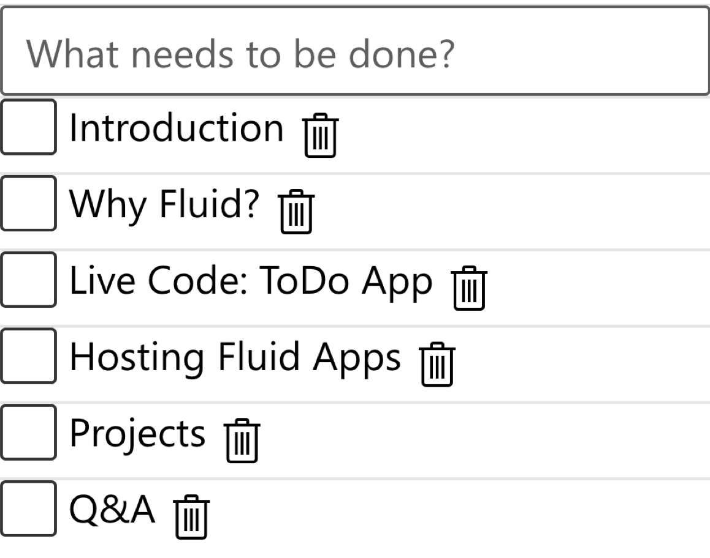

# ToDo
A playground for integrating some framework-style state management semantics into a todo app.

Generally targeting the functionality of todomvc.com.

# Getting Started
```
npm i
npm start
```

You can also run against FRS by creating a new tenant. You'll pass in the following information to a .env file stored at the root.
```
ID="Tenant ID"
KEY="Tenant Key"
ORDERER="Orderer URL"
STORAGE="Storage URL"
```

# Architecture

# Product


# Framework Comments

## "Fluid Component"-ization

By storing the dataObject in the Fluid Context, you're really pushing the developer to just consider one object. Or at least a relatively flat grouping of objects. We should make this better.

## ToDo DataObject

I think something interesting would happen if you have a dataobject per todo... then a list of handles as the todo list?

You'd be forced to consider the overall todo list

## Rules of Hooks - "don't use hooks within loops"
This is tricky if you want to set the state for one item in a list... a fairly common scenario for fluid

We'll have to componentize the next layer

# Gotchas
* You can't have onClick= () => ... where the ... includes React.useContext. You need to get a callback from a function that inherits the context via scope [[See Rules of Hooks]]
* getDataFromSubdirectory is just returning all of the children from subdir, so the typing is particularly weak
* Getting an **ITEM** back from a sharedSequence still isn't trivial.

# TODO
* Reset ToDo input to empty after enter
* TODO - can't delete first letter, dropping characters

# Style Guidelines
* Could I move the StateManagement into the data object?
* I could move state/hooks into some sort of aqueduct layer?